# 코코포리아 편집 사이트 사용법
## ① 텍스트 추출 사용법
#### 1. 먼저 코코포리아에서 [전체 로그 추출], 혹은 그냥 [로그 추출]을 진행합니다.
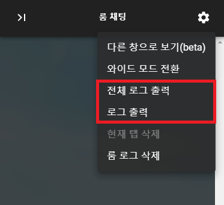
[전체 로그 추출]의 경우 모든 탭의 로그를, [로그 추출]의 경우 현재 내가 보고 있는 탭의 로그만 출력합니다.

#### 2. 이후, 다운로드 된 HTML 파일을 본 사이트의 [로그 자르기] 탭에 들어가 업로드합니다.
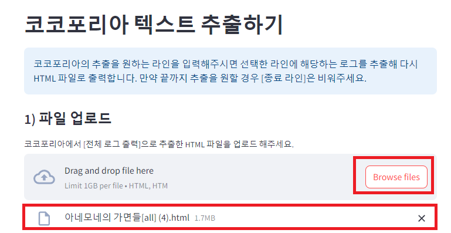

#### 3. 그 이후, HTML 파일 우클릭 > 연결 프로그램 > 메모장을 클릭해 HTML 파일을 메모장으로 엽니다.
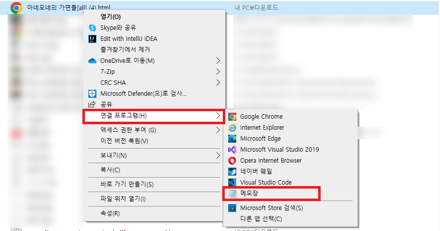

#### 4. 메모장을 열어 로그를 자를 첫 부분을 선택합니다. 이때 해당 문장을 드래그했을 때 하단에 나타나는 Ln 옆의 숫자를 봐주세요.
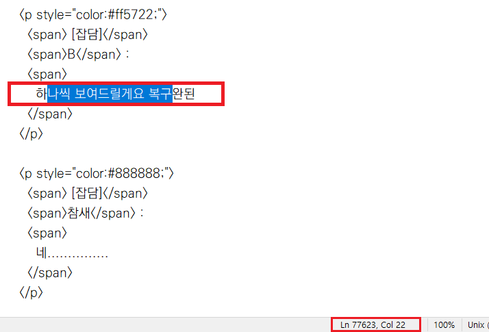
해당 사진에서 시작 라인은 77623입니다.

#### 5. 그리고 자를 부분의 마지막에 해당하는 대사를 드래그하고, 마찬가지로 하단의 Ln옆의 숫자를 확인합니다.
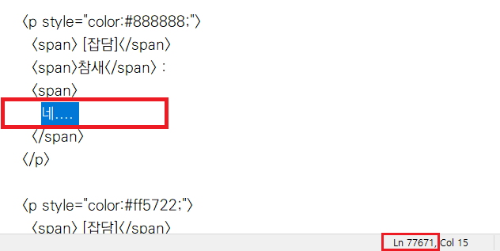
해당 사진에서 종료 라인은 77671입니다.

#### 6. [시작 라인]과 [종료 라인]을 입력한 뒤 [편집 파일 다운로드]를 누르면, 해당 라인만큼 잘린 파일을 다운로드 받을 수 있습니다. 이후 해당 파일을 코코로드에 넣으면 됩니다.
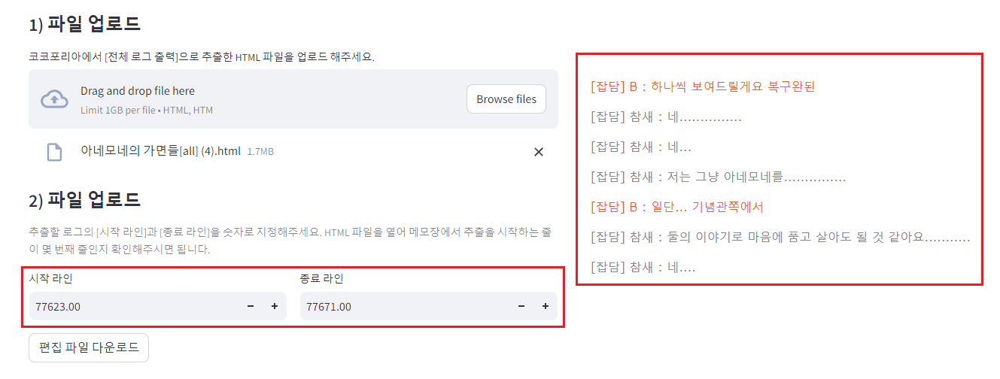
의도했던 텍스트만큼 잘린 걸 볼 수 있습니다.
st.divider()

## ② 이미지 변경 사용법
#### 1. 먼저 코코로그에서 로그 편집을 진행합니다.
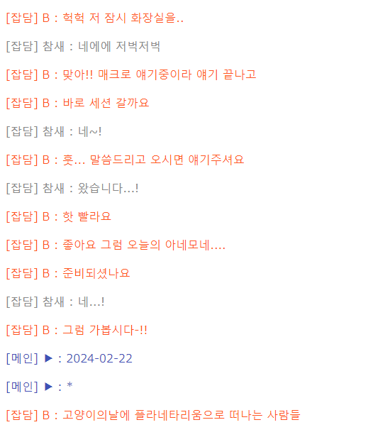
코코로그에서 편집할 예시 파일입니다.
 

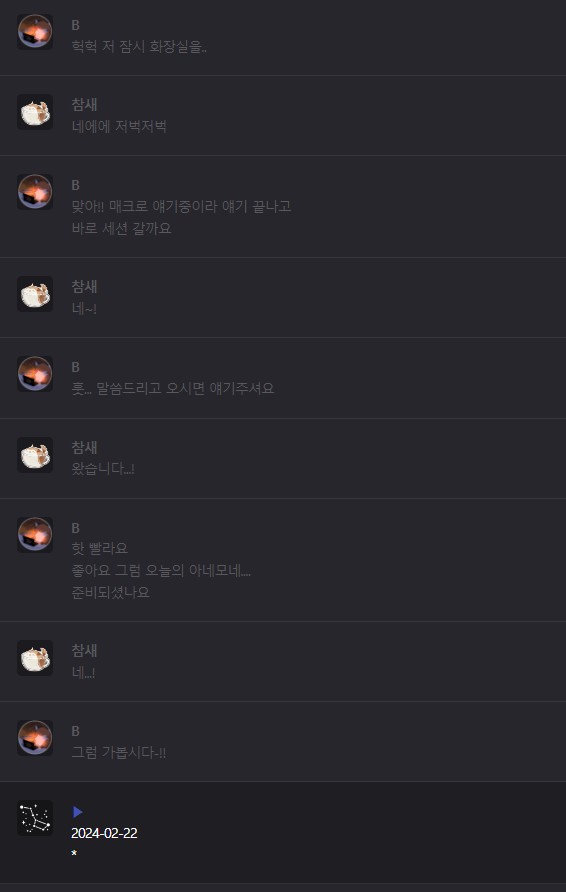
위의 HTML 파일을 코코로그에 넣어 해당 이미지처럼 편집합니다.

#### 2. 이후, 코코로그에서 다운로드 된 HTML 파일을 본 사이트의 [로그 자르기] 탭에 들어가 업로드합니다.
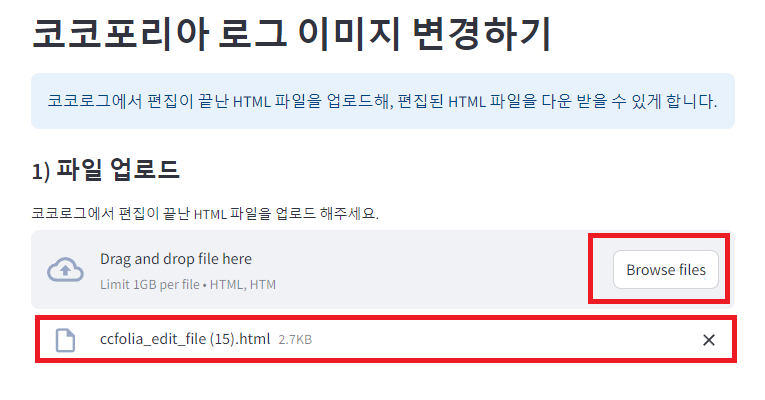

#### 3. 그 이후, 해당 HTML을 파일 우클릭 > 연결 프로그램 > 메모장을 클릭해 HTML 파일을 메모장으로 엽니다.
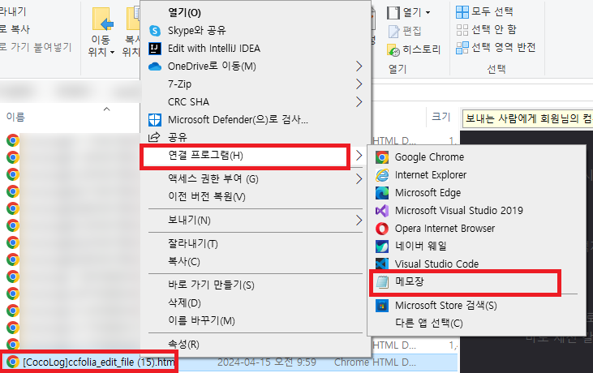

#### 4. 메모장을 열어 이미지를 변경할 첫 부분을 선택합니다. 이때 해당 문장을 드래그했을 때 하단에 나타나는 Ln 옆의 숫자를 봐주세요.
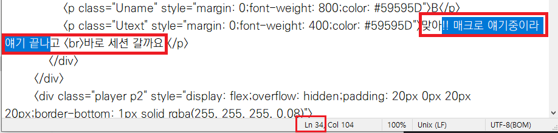
해당 사진에서 시작 라인은 34입니다.

#### 5. 그리고 이미지를 변경할 부분의 마지막에 해당하는 대사를 드래그하고, 마찬가지로 하단의 Ln옆의 숫자를 확인합니다.
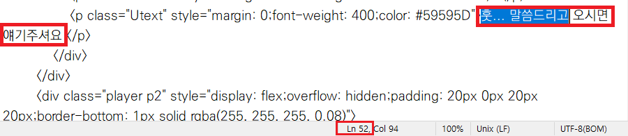
해당 사진에서 종료 라인은 52입니다.

#### 6. [시작 라인]과 [종료 라인]을 입력하고, 코코로그 사용 시 사용했던 [기존 이미지 주소]와 [변경할 이미지 주소]를 입력하고 [편집 파일 다운로드]를 누르면, 선택했던 라인만큼 프로필 이미지가 변경된 HTML 파일을 다운로드 받을 수 있습니다.
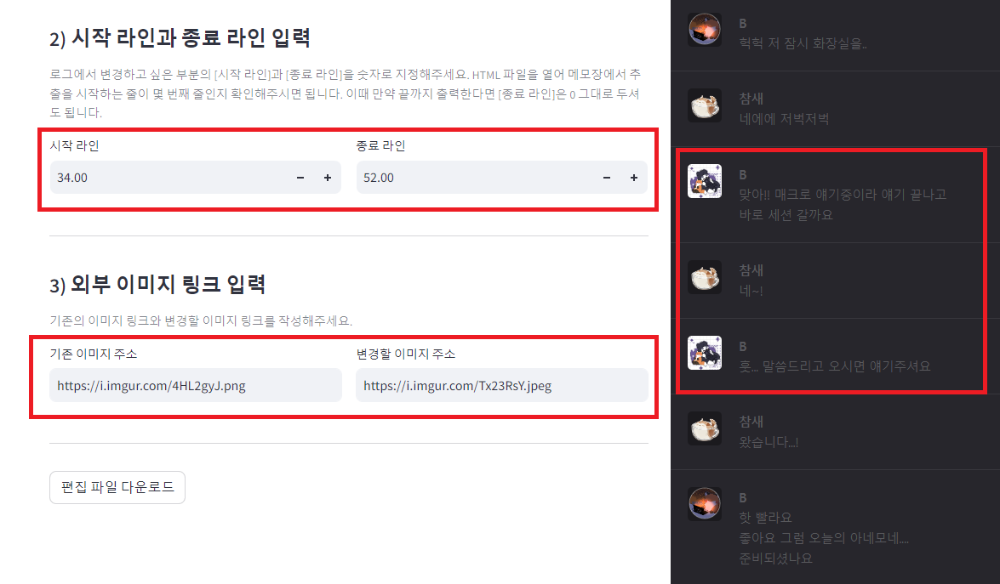
의도했던 텍스트만큼 잘린 걸 볼 수 있습니다.